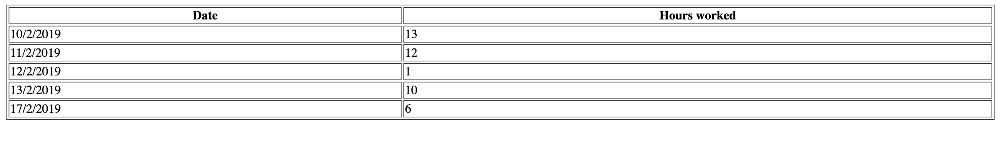

# Daily Timesheet
Calculate the daily working hours based on sign in and sign out. Below is the details for an employee for single week.

<table>
<tbody><tr>
<td></td>
<td>10-Feb</td>
<td>11-Feb</td>
<td>12-Feb</td>
<td>13-Feb</td>
<td>14-Feb</td>
<td>15-Feb</td>
<td>16-Feb</td>
<td>17-Feb</td>
</tr>

<tr>
<td>Saumil Nagariya</td>
<td></td>
<td></td>
<td></td>
<td></td>
<td></td>
<td></td>
<td></td>
<td></td>
</tr>

<tr>
<td></td>
<td></td>
<td></td>
<td></td>
<td></td>
<td></td>
<td></td>
<td></td>
<td></td>
</tr>

<tr>
<td>Start Shift</td>
<td>11:00</td>
<td></td>
<td></td>
<td></td>
<td></td>
<td></td>
<td></td>
<td></td>
</tr>

<tr>
<td>End Shift</td>
<td></td>
<td>12:00</td>
<td></td>
<td></td>
<td></td>
<td></td>
<td></td>
<td></td>
</tr>

<tr>
<td></td>
<td></td>
<td></td>
<td></td>
<td></td>
<td></td>
<td></td>
<td></td>
<td></td>
</tr>

<tr>
<td></td>
<td></td>
<td></td>
<td></td>
<td></td>
<td></td>
<td></td>
<td></td>
<td></td>
</tr>

<tr>
<td>Start Shift</td>
<td></td>
<td></td>
<td>23:00</td>
<td></td>
<td></td>
<td></td>
<td></td>
<td></td>
</tr>

<tr>
<td>End Shift</td>
<td></td>
<td></td>
<td></td>
<td>4:00</td>
<td></td>
<td></td>
<td></td>
<td></td>
</tr>

<tr>
<td></td>
<td></td>
<td></td>
<td></td>
<td></td>
<td></td>
<td></td>
<td></td>
<td></td>
</tr>

<tr>
<td></td>
<td></td>
<td></td>
<td></td>
<td></td>
<td></td>
<td></td>
<td></td>
<td></td>
</tr>

<tr>
<td>Start Shift</td>
<td></td>
<td></td>
<td></td>
<td>10:00</td>
<td></td>
<td></td>
<td></td>
<td></td>
</tr>

<tr>
<td>End Shift</td>
<td></td>
<td></td>
<td></td>
<td>16:00</td>
<td></td>
<td></td>
<td></td>
<td></td>
</tr>

<tr>
<td></td>
<td></td>
<td></td>
<td></td>
<td></td>
<td></td>
<td></td>
<td></td>
<td></td>
</tr>

<tr>
<td></td>
<td></td>
<td></td>
<td></td>
<td></td>
<td></td>
<td></td>
<td></td>
<td></td>
</tr>

<tr>
<td>Start Shift</td>
<td></td>
<td></td>
<td></td>
<td></td>
<td></td>
<td></td>
<td></td>
<td>17:00</td>
</tr>

<tr>
<td>End Shift</td>
<td></td>
<td></td>
<td></td>
<td></td>
<td></td>
<td></td>
<td></td>
<td>23:00</td>
</tr>
</tbody></table>

This code calculate the daily hours and generate the output as below:

